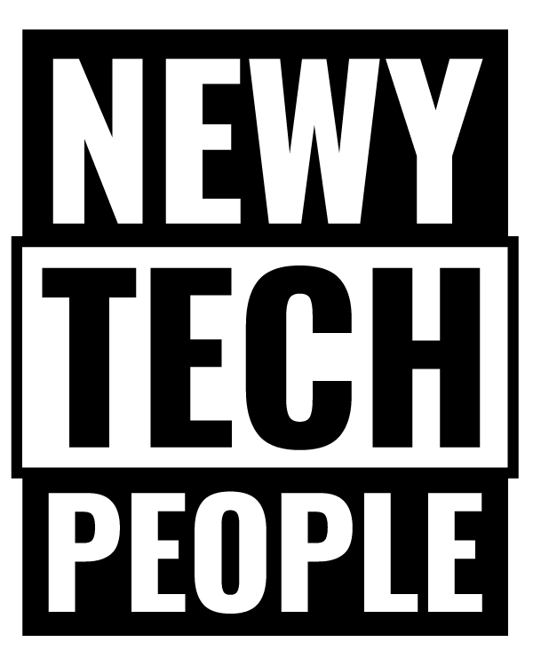
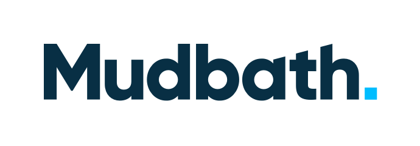

A meetup for all things JS and Web development

----

<h1 align="center"> <a href="https://github.com/newwwie/newcastlejs-meetup/issues/new"> Pitch a Talk Idea</a> :bust_in_silhouette::speech_balloon: </h1>

No talk = no :pizza: + :beer:

----

<table>
	<tr> 
		<td> <a href="https://www.meetup.com/NewcastleJS-JavaScript-Meetup/"> Meetup</a></td>
		<td> <a href="https://twitter.com/newcastlejs"> Twitter</a></td>
		<td> <a href="https://www.facebook.com/groups/newcastlejs/"> Facebook</a> </td>
	</tr>
</table>

----

## Future and Past Schedules

## 2021 Meetups

| Date | Event Details |
| --- | --- |
| **03 June** | [June Meetup: Alex Revell - Itrabble — my open source JS Library](https://www.meetup.com/NewcastleJS-JavaScript-Meetup/events/278230161/) |

## 2020 Meetups

	
 Click to view 

| Date | Event Details |
| --- | --- |
| **11 MAR** | [March Meetup - CSS Architecture for Modern JavaScript Applications](https://www.meetup.com/NewcastleJS-JavaScript-Meetup/events/268896206/) |

## 2019 Meetups

	
 Click to view 

| Date | Event Details |
| --- | --- |
| **16 JAN** | [Social Drinks :beer:](https://www.meetup.com/NewcastleJS-JavaScript-Meetup/events/) |
| **13 MAR** | [March Meetup - Javascript and Internet of Things](https://www.meetup.com/NewcastleJS-JavaScript-Meetup/events/258948683/) |
| **8 MAY** | [May Meetup - ELI5: Explain Web Jargon Like I'm 5 Years Old Lightning Talks](https://www.meetup.com/NewcastleJS-JavaScript-Meetup/events/258948710/) |
| **17 JUL** | [July Meetup - React Static + Contentful](https://www.meetup.com/NewcastleJS-JavaScript-Meetup/events/258948723/) |
| **11 SEP** | [September Meetup - Looking for speakers](https://www.meetup.com/NewcastleJS-JavaScript-Meetup/events/258948732/) |
| **13 NOV** | [November Meetup - Oh, the places you'll go](https://www.meetup.com/NewcastleJS-JavaScript-Meetup/events/258948742/) |
| **11 DEC** | [Christmas Developer Trivia :santa:](https://www.meetup.com/NewcastleJS-JavaScript-Meetup/events/266475329/) |

### 2018 Meetups

	
 Click to view 

| Date | Event Details |
| --- | --- |
| **28 FEB** | [Evolution of NIB's Design System](https://www.meetup.com/NewcastleJS-JavaScript-Meetup/events/248011877/) |
| **14 MAR** | [Matt Stow - A Room with a Vue](https://www.meetup.com/NewcastleJS-JavaScript-Meetup/events/248243867/) |
| **11 APR** | [2 Lighting Talks - API developer and charts!](https://www.meetup.com/NewcastleJS-JavaScript-Meetup/events/249583312/) |
| **09 MAY** | [Hrvoje Tutman - CloudSense: Heroku and NodeJS](https://www.meetup.com/NewcastleJS-JavaScript-Meetup/events/250353811/) |
| **13 JUN** | [Cathy Lill - Functional Programming for the Rest of Us](https://www.meetup.com/NewcastleJS-JavaScript-Meetup/events/251425666) |
| **11 JUL** | [Will Falconer - Flying Pink Flamingo (and point clouds) - 3D with React, ThreeJS](https://www.meetup.com/NewcastleJS-JavaScript-Meetup/events/252421398/) |
| **08 AUG** | [David Boyd - Moving towards Serverless?](https://www.meetup.com/NewcastleJS-JavaScript-Meetup/events/253449640/) |
| **12 SEP** | [Matt Stow - Intro to WebVR using A-Frame](https://www.meetup.com/NewcastleJS-JavaScript-Meetup/events/253638634/) |
| **10 OCT** | [Ben Cull - Embedding Javascript from Vanilla to Embedded Components](https://www.meetup.com/NewcastleJS-JavaScript-Meetup/events/253638643/) |
| **14 NOV** | [TBC](https://www.meetup.com/NewcastleJS-JavaScript-Meetup/events/253638650/) |
| **12 DEC** | [End of Year Drinks?](https://www.meetup.com/NewcastleJS-JavaScript-Meetup/events/253638709/) :santa: :beer: |

----

### 2017 Meetups

	
 Click to view 

| Date | Event Details |
| --- | --- |
| **08 FEB** | [Darren Nolan - React + BaconJS](https://www.meetup.com/NewcastleJS-JavaScript-Meetup/events/237059243/) |
| **08 MAR** | [Kris Howard - Knit One Compute One / Will Dampney - Code Quality in Node.JS](https://www.meetup.com/NewcastleJS-JavaScript-Meetup/events/238201912/) |
| **12 APR** | [Mike Riethmuller - Fluid Web Typography](https://www.meetup.com/NewcastleJS-JavaScript-Meetup/events/239002104/) |
| **10 MAY** | [Casual Drinks at The Edwards](https://www.meetup.com/NewcastleJS-JavaScript-Meetup/events/239863755/) |
| **14 JUN** | [Ethan Williams and Matt Murphy - Serverless Apps in AWS](https://www.meetup.com/NewcastleJS-JavaScript-Meetup/events/240659737/) |
| **19 JUL** | [Sean Standen - Angular at Homesales.com.au](https://www.meetup.com/NewcastleJS-JavaScript-Meetup/events/241393173/) |
| **09 AUG** | [Klee Thomas and Anjali Wadhwa - Postman](https://www.meetup.com/NewcastleJS-JavaScript-Meetup/events/242187309/) |
| **13 SEP** | N/A |
| **11 OCT** | [Josh Doolan - DockerTron](https://www.meetup.com/NewcastleJS-JavaScript-Meetup/events/243893733/) |
| **08 NOV** | N/A |
| **14 DEC** | N/A |

----

# Sponsors

| Sponsor |  |
| --- | --- |
|  | [Newy Tech People](https://newytechpeople.com.au/) |
|  | [Mudbath Digital](https://www.mudbath.com.au/)  |

----

# Community

 Discover more [Newcastle Tech Meetups](https://www.meetup.com/find/tech/?allMeetups=false&radius=2&userFreeform=Newcastle%2C+Australia&mcId=z1000658&mcName=Newcastle%2C+AU&sort=recommended&eventFilter=all) right here.
